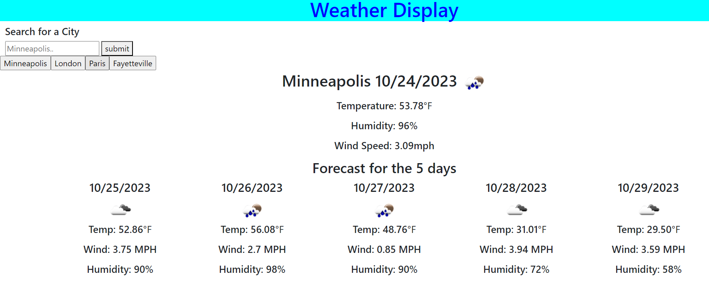

# Weather Display

https://github.com/Thaodev23/weather-display

https://thaodev23.github.io/weather-display/ 

## User Story

```
AS A web developer working for a weather forecast company
I WANT to develope an API data weather forecast
SO THAT the company I work for can forecast the weather
```

## Acceptance Criteria

```
Given that I work for a weather forecast company
When a city is inputted into the search bar
Then the current weather and the next 5 days of weather forecast will be display
When the city has been searched
Then the temperature in degree Fahrenheit, humidity and wind speed will be display
When a city or multiple cities been searched
Then the searced cities will be save in a list
When the list of searched cities is click on
Then data for that specific city will be display

```

## Image

Below: Image of the weather display. 


## Collaborators

```
Jason Yang:
Github profile - https://github.com/Jasony95
Classmate that collaborated on the homework assignment together.
 ```

```
Sichoun Nplhaib Lee:
Github profile - https://github.com/DDXP3.
Classmate that collaborated on the homework assignment together.
```


